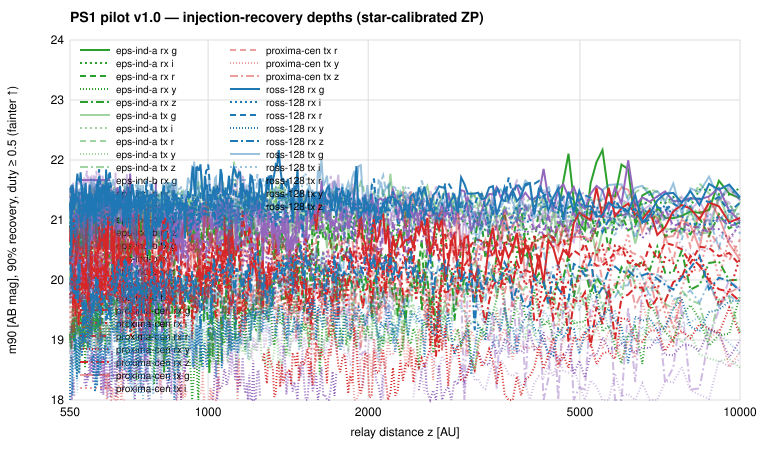

# Pan-STARRS1 pilot v1.0

**Question.** Can the archive-facing SGL pipeline run on an archive
outside IRSA, and what do the 2009–2014 PS1 3π warps say about relays
on the Sun's focal lines toward Ross 128, ε Indi and Proxima — the
same three corridors as the ZTF pilot, 5–10 years earlier?

**Answer.** Yes: MAST's warp listing, fitscut and catalogs API slot
behind the existing adapter interface with no change to `base.py`, and
the whole pilot ran in ~1.5 h while IRSA was saturated by the other
pipelines. No relay candidate survives on any corridor. 90 %-recovery
depths are m ≈ 21.0–21.4 AB in g/r/i (19.9 z, 19.0 y) for duty ≥ 0.5
and |µ| ≤ 1″/yr, comparable to ZTF but on a fixed grid with ~75 % usable
geometric hits instead of ZTF's chip-gap losses. Two findings shape the
scale-up: (1) PS1's cadence samples each corridor at essentially one
parallax phase (97:3), so the decisive static-background veto must come
from cross-archive epochs; (2) a per-frame zero point calibrated on
catalogued stars through the same matched filter — adopted after the
WISE/ZTF flux-scale erratum — is verified to ≤ 0.1 mag by the asteroid
control and removes the need for any a-posteriori throughput correction.

## 1. Setup

- Hypothesis freeze `surveys/panstarrs/hypotheses.md` v1.0: WISE/ZTF
  v1.0 physics (550–10,000 AU log-uniform, Rx/Tx, 99 % + 10″, duty
  ≥ 0.5, |µ| ≤ 1″/yr) with the Haleakalā site observer, grizy, IPP mask
  template 16255, star-calibrated flux scale, DR2 detection/mean
  screening catalogs.
- Corridors: Ross 128, ε Ind A and B, Proxima Cen — identical to the
  ZTF pilot so the two archives close the same cells with a combined
  2009–2026 baseline. Registry entries reused unchanged.
- Adapter `sglsurvey/adapters/mast_ps1.py` (hex-sampled `ps1filenames`
  listing, full skycell masks, fitscut cutouts, paged catalog cone
  queries; no published checksums for cutouts → sha256 of received
  bytes). Recon: `surveys/panstarrs/notes/mast_recon.md`.

## 2. Coverage

1,351 warps discovered on 11 skycells (2009-09 → 2015-01), 1,818
coarse hits, 1,355 usable or partial precise evaluations on 617 distinct
warps; ~20 epochs per filter per corridor. Every corridor is covered
over the full 550–10,000 AU range, but 70 % of usable evaluations have
disjoint covered z-intervals because GPC1 cell and OTA gaps cross the
arc, and the parallax-phase split is ~97:3 on every corridor (3π
revisits a field at the same season each year). Details:
`surveys/panstarrs/results/pilot_v1_summary.md`.

## 3. Search and calibration

Layer 1: 6,040 DR2 detections within 10″ of a track; the fixed-z point
filter (1.5″) finds at most 2–6 of ~31 visits supporting any z, with the
support spread along the arc (different field stars) or sitting on a
static star (Ross 128 rx, Proxima tx). Nothing track-following.

Layer 2: matched-filter forced photometry on 617 image+weight cutouts
with full-mask usability, 360-node 1/z grid × 5×5 µ grid, 8 offset
controls, epoch floor N ≥ 5, single-epoch clip 5σ, phase-split stacks.
The `.wt` plane is verified to be variance; the matched-filter S
distribution is 1.6× wider than Gaussian (resampling-correlated noise),
which the empirical control thresholds (T = 4.8–9.8) absorb. Six real-
track maxima exceed T; all six are **single-phase** (the other phase
has 0 epochs at that cell) and are vetoed. **0 Candidate records
survive.**

Flux scale: per-warp ZP from 5–100 DR2 stars (MAD 0.07–0.12 mag per
filter) = FPA.ZP + 2.5 log EXPTIME − ≈0.5 mag kernel throughput.
Positive control: asteroid (60000) recovered at 0″ in g/z/y with
magnitudes matching Horizons + solar colours to ≤ 0.1 mag.

AnalysisRun `run-d6ff91459819`: 320 Constraint records (302 recovery
curves, 18 not-constrainable cells, chiefly ε Ind A rx g where only 7 %
of cells reach the epoch floor).

## 4. Interpretation

Depths are set by confusion and correlated resampling noise rather than
photons. Reflected-sunlight limits (albedo 0.1) are D ≲ 7×10⁴ km at
550 AU and ≳ 2×10⁶ km beyond 3,000 AU — planet-scale reflectors only,
as for ZTF. Self-luminous sources are limited at ≈ 13 µJy (i, 21.0 AB)
over 2009–2014, a window no other adapter covers at 1″ resolution.
These constrain the reflected/self-luminous optical cell only; they are
not thermal coverage.

## 5. What changes for the scale-up

1. **Phase coverage is cross-archive.** A PS1 overlay should record the
   phase split per corridor; the stage-2 likelihood must be able to
   combine PS1 epochs with ZTF/WISE epochs at the other phase, or PS1
   nulls remain single-phase qualified.
2. Star calibration needs a calibration cutout decoupled from the
   locus cutout for sparse high-latitude corridors (Ross 128 had < 5
   calibrators in most frames); keep the global per-filter fallback and
   the non-photometric guard.
3. Duplicate-skycell collapsing and per-warp cutout sizing work; the
   asteroid control should pick an object with denser PS1 coverage
   (only 30 warps on 431 nights for (60000)).
4. Scale-up membership: the universal list north of δ = −30° (PS1
   overlay to build, as the ZTF one), runnable entirely off MAST.

---

## Status note (2026-08-22) — exploratory, pending v2

The WISE scientific review of 2026-08-21
(`surveys/wise/scientific_review.md`) applies to this report: the
8-offset control maximum is a per-search rank statistic (≈ 1/9
crossing probability for a noise-only cell — the "≈ 86 expected at the
1/8 chance rate" already noted), so "FAR" language is a rank statement;
injections were analytic and tensor-level, so the quoted depths are
*threshold sensitivity* (`completeness_kind = threshold`) without
confidence intervals, and the on-grid vs off-grid depth difference
recorded for the common-T0 tensors is a symptom of exactly that; the
split-half, other-band and grid-edge vetoes are heuristic, while the
DR2-star catalogued-static test and the direct ZTF forced photometry
are the only rejections resting on independent evidence; the locus was
evaluated at its nominal position (the 1–2″ optical PSF makes the
covariance check stricter than for WISE). No number is recomputed
here. The defensible conclusion is *no compelling candidate after
heuristic review*. The calibrated version is the PS1 v2 survey
(project plan §10.1 step 6).
