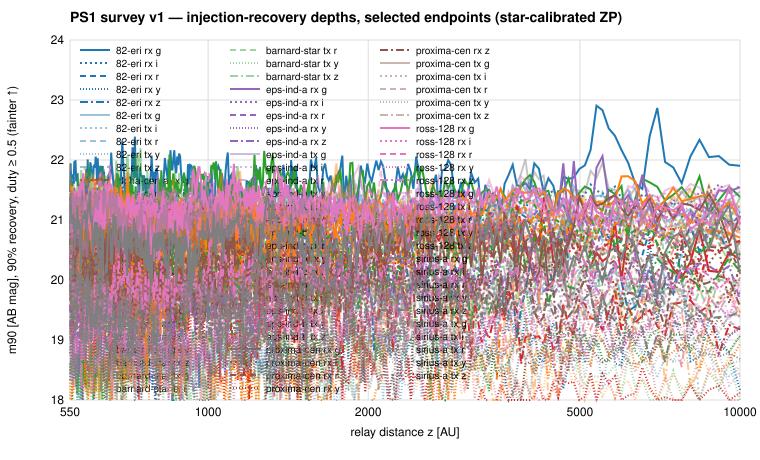

# Pan-STARRS1 survey v1

**Question.** With the PS1 adapter validated on three corridors
(`ps1_pilot_v1.md`), what do the 2009–2014 3π warps say about relays on
the Sun's focal lines toward every universal-list system north of
δ = −30°?

**Answer.** No detection. Across 62 corridors (69 endpoints, Rx and Tx,
grizy) the 90 %-recovery depths for a persistent point source with duty
≥ 0.5 and |µ| ≤ 1″/yr are m ≈ 21.1 (g), 20.9 (r), 20.7 (i), 19.9 (z),
18.9 (y) AB, with a 10–90 % spread of ±0.3–0.4 mag set by field
crowding and seeing. The threshold-exceedance census (78 of 690 cells,
11.3 %) sits at the rate the 8-control threshold implies by
construction; 72 are vetoed by the parallax-phase test, 3 by stage-7
adjudication (two catalogued stars on the track, one non-persistent),
and 3 were marginal — at-threshold, grid-edge, or single-filter cells
with no catalogued counterpart — all three since **vetoed** by forced
photometry on 900–1,200 ZTF frames along their PS1-fitted trajectories
(S = 0.2, 1.4, −0.1; `joint_ps1_ztf_v1.md`).
The whole survey ran in ~5 h entirely off MAST while IRSA was saturated.

## 1. Setup

Hypotheses `surveys/panstarrs/hypotheses.md` v1.0 unchanged from the
pilot. Membership from the universal list v2 via the PS1 overlay
(`surveys/panstarrs/targets/overlay_v1.md`): 62 of 77 corridors have
δ > −30°; the 15 southern corridors (Lalande 21185, Ross 248, 61 Cyg,
Struve 2398, Groombridge 34, GJ 1221, GJ 338, GJ 625, GJ 687, GJ 251,
σ Dra, HD 219134, Wolf 1069, GJ 3512, GJ 13157) are SPHEREx/WISE-only.
The overlay records, per corridor, the warp count, the parallax-phase
split (≤ 12 % minor phase everywhere) and the DR2 calibrator density.

Two additions over the pilot: a dedicated 1,600-px calibration cutout
fetched lazily when the locus cutout holds < 5 DR2 calibrators (358
frames rescued; 97.6 % of 5,516 flux maps now carry a per-frame star
zero point), and per-batch purging of image products so the live
footprint stayed ≈ 20 GB while ≈ 150 GB passed through.

## 2. Coverage

24,852 warps discovered; 23,184 coarse hits; 16,527 usable or partial
precise evaluations (71 %) on 7,817 distinct warps; 41 masks not served.
Median 80 epochs per endpoint-role across five filters (≈ 16 per
filter). Every corridor is covered over 550–10,000 AU; 98 of 5,520
z-interval cells are not constrainable (fewer than 5 epochs survive the
floor, mostly g and y at the sparsest corridors).

## 3. Search

Layer 1: 134,874 DR2 detections within 10″ of a track over 138
endpoint-roles; recurrence saturated by field stars; 28 static stars
identified by the fixed-z point filter; nothing track-following.

Layer 2: 138 sample tensors (360-node 1/z × 5×5 µ × 9 trajectories),
thresholds T = 4.8–9.8 from the 8 offset controls, epoch floor, 5σ
single-epoch clip, phase-split test. 78 real-track maxima exceed T
(expected ≈ 86 at the 1/8 chance rate). Adjudication of the 6 that pass
the automatic phase test (`runs/panstarrs/calib_v1/adjudication.json`):

| cell | S / T | verdict |
|---|---|---|
| GJ 783 tx z (z ≈ 9,540 AU) | 6.89 / 6.89 | vetoed: DR2 star 1.2″ from the major-phase position, i-band S = 10.6 |
| LHS 1723 rx z (≈ 830 AU) | 7.46 / 6.08 | vetoed: DR2 star 1.7″, i-band S = 5.2 |
| GJ 65 A rx y (≈ 830 AU) | 6.04 / 5.72 | vetoed: split-half 1.0 / 6.6 |
| 82 Eri rx y (≈ 7,230 AU, µ = −0.5, +1.0) | 9.37 / 8.19 | marginal: y-only (other filters ≤ 2.7σ), both halves significant, no CatWISE/unWISE/2MASS/Gaia counterpart within 4″, µ at grid edge |
| Fomalhaut rx y (≈ 574 AU, µ = +1, 0) | 5.42 / 5.15 | marginal: at threshold, z and µ at grid edge |
| GJ 526 tx z (≈ 559 AU, µ = −1, −0.5) | 5.15 / 5.13 | marginal: at threshold, grid edge, other filters negative |

A y-only source at the 82 Eri cell would need i − y ≳ 1.5 (brown-dwarf
colours) and would then be W1 ≈ 15–16, which CatWISE excludes. The
cross-archive test (stage 2, `joint_ps1_ztf_v1.md`) then vetoed all
three: ZTF g+r stacks of 897 / 1,206 / 1,023 frames (2018–2026, both
phases) along the PS1-extrapolated (z, µ) tracks give S = 0.19 / 1.42 /
−0.11 against control maxima 2.83 / 1.46 / 0.25. **The PS1 survey
closes with zero candidates.**

AnalysisRun `run-c2806acd56a3` (supersedes `run-eaa6d89a1ec9`; the
catalogued-static-source test is now in the automatic rules): 5,520
Constraints, 78 Candidates (72 phase-vetoed; 6 retained by the
automatic rules, all 6 vetoed by direct ZTF forced photometry along
their PS1-fitted tracks — `runs/joint/ps1_ztf_v1/marginal_tests.json`),
0 detections.

## 4. Interpretation

Same physical cell as the ZTF survey, 9–17 years earlier: reflected
sunlight (albedo 0.1) limits D ≲ 7×10⁴ km at 550 AU rising as z² —
planet-scale reflectors only; self-luminous optical sources limited at
≈ 13–20 µJy (g–i) over 2009–2014. Not thermal coverage. Because PS1
samples one parallax phase, these are *single-phase-qualified* nulls:
a static background source at the major-phase track position is
excluded only where the ZTF/WISE epochs at the other phase say so.

## 5. Next

1. ~~Cross-archive stage 2~~ — done: `joint_ps1_ztf_v1.md` (joint µ = 0
   stack with both parallax phases on 321 of 414 cells, m90 ≈ 23.3 AB in
   g/r; marginal cells vetoed).
2. DECam/NOIRLab (reachable, unprobed) is the optical option for the 15
   southern corridors.

---

## Status note (2026-08-22) — exploratory, pending v2

The WISE scientific review of 2026-08-21
(`surveys/wise/scientific_review.md`) applies to this report: the
8-offset control maximum is a per-search rank statistic (≈ 1/9
crossing probability for a noise-only cell — the "≈ 86 expected at the
1/8 chance rate" already noted), so "FAR" language is a rank statement;
injections were analytic and tensor-level, so the quoted depths are
*threshold sensitivity* (`completeness_kind = threshold`) without
confidence intervals, and the on-grid vs off-grid depth difference
recorded for the common-T0 tensors is a symptom of exactly that; the
split-half, other-band and grid-edge vetoes are heuristic, while the
DR2-star catalogued-static test and the direct ZTF forced photometry
are the only rejections resting on independent evidence; the locus was
evaluated at its nominal position (the 1–2″ optical PSF makes the
covariance check stricter than for WISE). No number is recomputed
here. The defensible conclusion is *no compelling candidate after
heuristic review*. The calibrated version is the PS1 v2 survey
(project plan §10.1 step 6).
