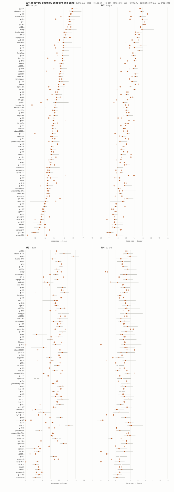

# WISE/NEOWISE SGL Survey — Report v2

**Date:** 2026-08-19 · **Status:** 26 endpoints / 23 corridors searched, no surviving candidate, 1,664 injection-calibrated constraints · **Supersedes:** `wise_shakedown_v1.md` (the 12-endpoint shakedown report)

**Pins:** registry v1.3 `sha256:a476a3e3…` · hypotheses v1.3 (physics parameters frozen at v1.0, endpoint set expanded v1.1–v1.3) · sglseti `21f6f3d` / `tusay2022_eq5_7_v1` v1.1.0 · calibration AnalysisRun `run-04d6098fb26e`

## Summary

We searched 14.5 years of WISE/NEOWISE single-exposure imaging
(2010–2024) for compact persistent sources on the solar
gravitational-lens focal lines of nearby stellar systems. Since the
v1 shakedown report, the survey has grown from an ad-hoc pilot to a
**principled target portfolio**: a survey-agnostic universal target
list built from the CNS5 8 pc census (protected distance core +
geometric-adjacency, historical-approach, and white-dwarf-wildcard
baskets), with a WISE-specific overlay that grades corridors by
*measured* confusion and orders the work queue. Three batches later,
**26 endpoint hypotheses across 23 corridors (52 endpoint-role
hypotheses) are searched: no candidate survives.** Thirteen threshold
or marginal excesses were individually adjudicated and vetoed — static
field stars caught by the parallax-phase test, one bright-star halo,
one single-epoch artifact, and control-level placement variance. Every
endpoint carries 90%-recovery flux limits over 550–10,000 AU in all
four WISE bands.

## 1. Search definition

Unchanged from v1 (frozen 2026-08-18): station-kept relay on the
Sun–star focal line; Rx and Tx as separate hypotheses; relay distance
550–10,000 AU (log-uniform prior); unresolved point source; duty
cycle ≥ 0.5; residual motion |µ| ≤ 1″/yr; 99% propagated confidence
+ 10″ padding; Earth-center observer (declared ~2.5 mas
approximation). Out of scope (separate model IDs): barycenter and
planetary endpoints, duty < 0.5, |µ| > 1″/yr, extended morphologies.

**Endpoints (26).** Pilot + expansions, all with per-value provenance:
Barnard's Star, Ross 154, Lalande 21185, α Cen A/B, Sirius A/B
(v1.0); Proxima Cen, Wolf 359, Ross 248, GJ 65 A/B (v1.1); Ross 128,
ε Ind A, τ Cet, GJ 54, Teegarden's Star, Lacaille 8760, van Maanen's
Star (first white-dwarf wildcard), GJ 908, GJ 784 (v1.2); ε Eri,
Lacaille 9352, GJ 1061, GJ 12724, Wolf 1061 (v1.3). Curation
highlights: the Hipparcos Sirius solution validated *as* the
orbit-corrected barycenter (0.16″ vs 2MASS); GJ 65's barycenter
constructed from mass-weighted Gaia components (0.34″/17.4 yr vs
2MASS; orbit convention closed to 0.013″ vs the Gaia relative
position); τ Cet and ε Eri adopted with ×3-inflated uncertainties
(saturation-degraded RUWE); ε Ind Ba/Bb deferred (photocenter rides
its 11-yr orbit).

## 2. Target selection: universal list + survey overlay

The v1.1+ expansions follow `targets/universal_v1` — a
survey-agnostic portfolio (37 systems / 49 tracks within 8 pc) built
from five baskets with auditable inclusion labels: a **protected
distance core** (nearest 25 systems, no exclusions — substellar
systems included and gated, not dropped), **robust geometric
neighbors** (≥3 of 7 sparse-graph families: Delaunay, Gabriel, RNG,
MST, mutual-kNN), **selective neighbors** (re-vote after dropping
flagged hosts), **historical neighbors** (±1 Myr linear closest
approach; standout: GJ 11068, passing within 0.33 pc), and
**compact-lens wildcards** (isolated white dwarfs). The network prior
and archive searchability are separate columns, never merged.

The WISE overlay (`surveys/wise/targets/`) measured per-corridor
confusion (CatWISE source density spans 3,700–29,000 deg⁻²; brightest
2MASS Ks flag) and ordered the queue accordingly. **The grades proved
predictive:** low-confusion corridors delivered W1 depths of
16.5–17.5, mid-confusion 13.7–17.0, and the crowded pilot corridors
bottom at ≈13.

## 3. Data, coverage, and records

Archive: IRSA merged L1b frame inventory (verified union of all four
WISE mission phases; 62.7M rows), with md5-verified products from the
unified IBE tree. Per corridor: ~330–450 usable W1/W2 epochs across
2010–2024 plus 14–40 cryo W3/W4 frames. Masks split 44% of geometric
hits into disjoint covered relay-distance intervals — interval-valued
coverage is the norm and every record carries its intervals.

| Record stream | Count |
| --- | --- |
| QuerySnapshot (verbatim archive responses) | 692 |
| Observation (unique frame-band products) | 50,109 |
| IntersectionEvaluation (coarse + precise) | 113,770 + 46,295 |
| ScreenMatch (catalog detections vs tracks) | 120,911 |
| Constraint (current, run-04d6098fb26e) | 1,664 |
| Candidate (all vetoed, with recorded reasons) | 13 |

Archive-data footprint: 11 GB under `runs/wise/`, all regenerable from
tracked scripts, snapshots, and checksums.

## 4. Search results and adjudications

**Catalog screening** produced ~90–200 chance matches per visit per
endpoint-role; every fixed-z recurrence peak resolved as a static
background star via the **parallax-phase test** (detections confined
to one ~5-day day-of-year window per year, where a genuine relay is
carried to both alternating parallax phases by the locus).

**Forced-photometry stacks** — matched-filter fluxes stacked jointly
over a 64-node relay-distance grid (uniform in 1/z; constant ~5.6″
node spacing) × 5×5 residual-motion grid, thresholded per
endpoint-role-band at the maximum of **8 offset-control trajectories**
(empirical FAR < 1/8 per grid search; the W1/W2 search is field-star
contamination limited, with control maxima up to S ≈ 2,650).

**13 of 208 pair-band searches exceeded threshold; all vetoed:**

| Mechanism | Cells | Example |
| --- | --- | --- |
| Single-phase static field star | 7 | proxima-cen/tx/W2: phase split −6.7 / +284.8 |
| Bright-star halo (screening excludes a real source that bright) | 1 | sirius-a/rx/W2: S=871 vs T=451 |
| **Single-epoch dominance** (one frame carries the stack) | 1 | lacaille-8760/rx/W1: MJD 57855 contributes S=397.8 of 399.3 |
| Single-visit cryo placement variance (≤3% over an 8-draw null) | 4 | barnard-star/tx/W3: 8.8 vs 8.7 |

A subtlety worth recording: gj-1061/tx exceeded in W1 *and* W2 at the
same cell — cross-band consistency mimicking a real source — but the
phase split and star-like flux ratio identified a static star whose
own cross-band consistency produced the pairing.

## 5. Completeness

Injection recovery (analytic Gaussian-source injections at every grid
node, randomized duty realizations, recovery = exceeding the
predeclared threshold at the true cell) yields 90%-recovery depths
per endpoint × role × band × z-interval:

Depth is set by corridor crowding and bright-star artifacts, not
photon noise. Full 64-node curves: `runs/wise/calib_v1/m90_curves.npz`;
per-interval values in the 1,664 Constraint records.

## 6. Physical interpretation

Band physics is not interchangeable. At representative depths
(W1 15.5 / W2 14.4 / W3 12.6 / W4 10.4 ≈ 195 / 300 / 290 / 580 µJy):

| Emitter model at relay distance z | z = 550 AU | 1,000 AU | 3,000 AU |
| --- | --- | --- | --- |
| 300 K radiator (via W3) — radius ≥ | **39 km** | 71 km | 212 km |
| 300 K radiator (via W2) — radius ≥ | 230 km | 418 km | 1,260 km |
| 150 K radiator (via W3) — radius ≥ | 311 km | 566 km | 1,700 km |
| 12 K solar-equilibrium blackbody | unconstrained at any physical size (peaks ~240 µm) |
| Reflected sunlight, a_geo = 0.1, full phase — diameter ≥ | 4.8×10⁵ km | 1.6×10⁶ km | — |

The survey meaningfully constrains **warm, actively powered
structures** (a ~40 km 300 K radiator at the near focal line would be
recovered at ≥90% probability from the 2010 cryo epochs) and hot or
nonthermal emission over the full 14.5-yr baseline. It does **not**
constrain cold passive infrastructure or planet-scale reflectors.

## 7. Caveats

Gaussian-PSF search/injections (throughput, not PSF-wing mismatch);
8 controls per pair-band (coarse FAR resolution); W3/W4 rest on one
2010 visit; no known-moving-object positive control yet; nulls cover
the frozen hypothesis cell only. Pipeline improvement identified in
batch 2 and scheduled: an **effective-epoch floor / weight cap** in
the stack, closing the single-epoch-dominance capture mechanism at
the estimator level rather than by post-hoc veto.

## 8. Remaining work queue

10 systems queued (8 high-confusion: Luhman 16, 61 Cyg, Procyon,
Groombridge 34, Luyten's Star, LP 145-141, GJ 1221, GJ 9193; 2
bright-star: GJ 1111, Kapteyn's Star) and 5 deferred with named
unblocking conditions (published orbits: Struve 2398, GJ 783;
non-Gaia astrometry: WISE 0855, EZ Aqr, GJ 11068; photocenter orbit:
ε Ind Ba/Bb).

## 9. Reproducibility

Every stage emits immutable content-addressed records pinned to the
registry hash, hypothesis version, geometry model, ephemeris, and
seeds; raw archive responses snapshotted verbatim; all products carry
archive checksums. Constraint chains resolve: constraint → analysis
run → sample tensors → usable-pixel intersections → mask products →
snapshotted queries. Stage summaries: `surveys/wise/results/`;
curation evidence: `surveys/wise/notes/registry_curation.md`;
target-selection method: `notes/sgl_seti_star_ranking_methods.md` +
`targets/`.
