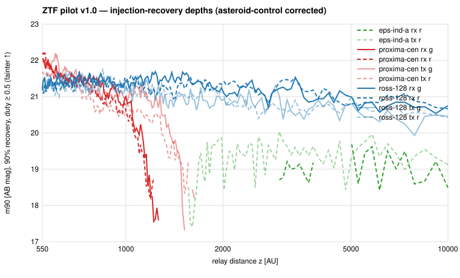

# ZTF pilot v1.0

**Question.** Does the archive-facing SGL pipeline built on WISE
survive a genuinely different archive, and what does 8 years of 1″
optical imaging say about relays on the Sun's focal lines toward three
nearby stars?

**Answer.** The interfaces survive with two generalisations (hybrid
search image with a per-cell difference-image fraction; per-cell epoch
floor + single-epoch clip in the estimator). No relay candidate
survives on any of the three corridors. 90 %-recovery depths are
m ≈ 21.2–21.5 AB (g, r) for duty ≥ 0.5 and |µ| ≤ 1″/yr, which excludes
only reflectors ≳ 7×10⁴ km (albedo 0.1) at 550 AU. The pilot's most
valuable outputs are three lessons that change the scale-up: ZTF's
fixed grid puts ≈13 % of sky in chip gaps and all three pilot antipodes
landed in or beside one; difference images do not cover the quadrant
edge strip; and the asteroid positive control exposed a flux-scale
error in the shared estimator that also affects the published WISE
depth labels (`surveys/wise/results/erratum_flux_scale_2026-08-20.md`).

## 1. Setup

- Hypothesis freeze `surveys/ztf/hypotheses.md` v1.0: WISE v1.0
  physics (550–10,000 AU log-uniform, Rx/Tx, 99 % + 10″, duty ≥ 0.5,
  |µ| ≤ 1″/yr) with the Palomar P48 site observer, g/r/i, ZSDS quality
  inputs, and explicit reflected-light / self-luminous interpretations.
- Corridors: Ross 128 (on the ecliptic, clean), ε Ind A (southern star,
  corridor at Dec +57°), Proxima Cen (Galactic plane, crowded).
  Registry entries reused unchanged from the shared registry v1.5.
- Adapter `sglsurvey/adapters/irsa_ztf.py` (IBE metadata search, IBE
  data tree, cutouts on sci / msk / fpacked diff, no published
  checksums → sha256 of received bytes). Recon: `surveys/ztf/notes/irsa_recon.md`.

## 2. Coverage

7,930 public quadrant-exposures discovered (2018-03 → 2026-06), 1,896
coarse hits, 1,480 usable precise evaluations. Covered relay-distance
ranges: Ross 128 full 550–10,000 AU over 8 years, both parallax phases;
Proxima only 550–1,900 AU and a single parallax phase (antipode in the
CCD 9/10 gap of field 808); ε Ind A 24 evaluations total (4-CCD
junction of field 786; only the sparse secondary field covers it).
Figures and tables: `surveys/ztf/results/pilot_v1_summary.md`.

## 3. Search and calibration

Layer 1: 7,786 psfcat matches within 10″; the fixed-z point filter
resolves the only tight recurrence (Ross 128 tx, z ≈ 892 AU) as a
static star. Layer 2: matched-filter forced photometry on 797 cutout
sets, 192-node 1/z grid × 5×5 µ grid, 8 offset controls, phase-split
stacks. The per-pixel variance model is Gaussian to 2 %. After the
epoch floor and clip, thresholds are T = 4.3–7.9 and every real-track
maximum is ≤ T; the two exceedances seen before the clip were phase-
vetoed. **0 Candidate records survive.**

Positive control: asteroid (60000) (V 19.1–20.2) recovered at the
Horizons position with S = 28 (g) / 41 (r); this caught the peak-
amplitude-vs-total-flux convention (Δm = 2.5 log10 2πσ²) and measured
a residual 0.5 mag Gaussian-vs-Moffat aperture loss, now applied.

AnalysisRun `run-1f02c325fd66`: 80 Constraint records (59 recovery
curves, 21 not-constrainable cells — chiefly Proxima z > 1,350 AU and
ε Ind A z < 1,350 AU, which the archive never covers with ≥ 5 epochs).

## 4. Interpretation

Optical depth is confusion-limited: in the science-image regime faint
static stars on the track, in the difference regime subtraction
residuals; the photon-noise limit would be ≈ 24 AB. Reflected-sunlight
limits (albedo 0.1) are D ≲ 7–9×10⁴ km at 550 AU and ≳ 10⁶ km beyond
2,000 AU — planet-scale reflectors only. Self-luminous sources are
limited at the same magnitudes (≈ 10 µJy in r). These are honest
constraints on a different physical cell from the WISE thermal limits;
neither is "coverage" of the other.

## 5. What changes for the scale-up

1. Overlay must compute primary-grid pixel position and secondary-field
   epoch counts per corridor; flag single-phase coverage.
2. Build a per-corridor reference from the 8-year cutout stack to
   extend difference imaging into the edge strip.
3. Keep the asteroid control in every batch; consider a second, fainter
   control (V ≈ 21) to probe the stack regime directly.
4. Decide how to apply the WISE depth-label erratum (rerun tensors, or
   constant per-band correction in the report).

Then: 52 in-footprint universal-list systems through the same chain;
SPHEREx (plan §6) for the 24 southern-corridor systems.

---

## Status note (2026-08-22) — exploratory, pending v2

The WISE scientific review of 2026-08-21
(`surveys/wise/scientific_review.md`) applies to this report as well,
because the same constructions were copied from WISE: the 8-offset
control maximum is a per-search rank statistic (a noise-only cell
exceeds it with probability ≈ 1/9), injections were analytic and added
to sampled tensors rather than to images, vetoes other than the
catalogued-static-source test are heuristic review rules with
unmeasured selection functions, and the locus was evaluated at its
nominal position. Accordingly, without recomputing any number
(`notes/project_plan.md` §10.1 step 2): "FAR < 1/8" statements are
to be read as rank statements among 8 exchangeable controls;
"90 %-recovery" depths are *threshold sensitivity* (`completeness_kind
= threshold`), not final-candidate completeness, and carry no
confidence interval; phase-split, split-half, season and other
non-catalogue vetoes are heuristic; exceedance counts at the 1/9 rank
rate are the expected chance rate, as `look_elsewhere.py` already
showed. The defensible conclusion is *no compelling candidate after
heuristic review*. The calibrated version is the ZTF v2 survey
(project plan §10.1 step 6), built on the WISE v2 design.
