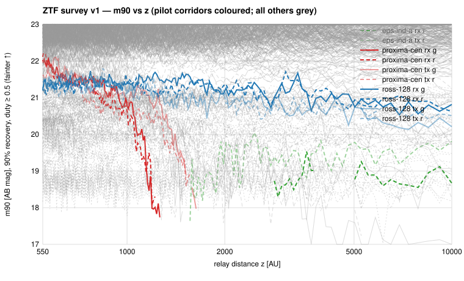

# ZTF survey v1

**Question.** Across every universal-list corridor ZTF can see, is
there an optical source that follows the predicted Solar-gravitational-
lens relay track (parallax ellipse + anti-target drift, 550–10,000 AU,
duty ≥ 0.5, |µ_resid| ≤ 1″/yr) toward any of 69 nearby-star endpoints?

**Answer.** No. 147,063 public ZTF quadrant-exposures (2018-03 →
2026-06) were joined to the tracks; 148,032 usable precise
intersections, 1.69 M catalog matches and 65,827 matched-filter flux
maps were searched on a 192 × 5 × 5 (z, µ) grid per endpoint × role ×
filter. 24 cells exceeded their 8-control thresholds; 14 fail the
parallax-phase test, 2 fail held-out splits, and the survey-wide
leave-one-out control population (41 expected exceedances vs 24
observed; real S/T distribution below the controls' at every
percentile) shows the remainder are the expected chance tail. **2,640
ledger-ready Constraint records, 0 surviving candidates** (AnalysisRun
`run-1dc29a973d0c`).

**Depths.** 90 %-recovery m90 median 22.5 (g) / 22.4 (r) / 20.1 (i) AB,
best 23.6 (GJ 11547); ok-graded corridors 22.6, gap-graded 21.3. For
reflected sunlight (albedo 0.1) this excludes D ≳ 4×10⁴ km at 550 AU
and ≳ 10⁶ km beyond 2,000 AU; for self-luminous sources ≈ 4 µJy in r.

## What was run

Pilot v1.0 (`report/ztf_pilot_v1.md`) fixed the interfaces; the
scale-up re-ran the identical chain over the ZTF overlay
(`surveys/ztf/targets/overlay_v1.md`: 62 visible corridors, grid
grading 29 ok / 18 edge / 15 gap). Stage numbers, depth tables, look-
elsewhere statistics and the adjudication log are in
`surveys/ztf/results/scaleup_v1_summary.md`; records under
`runs/ztf/{coarse,precise,screen,calib}_v1/records/`.

Positive control: asteroid (60000) recovered through the same code
path at the Horizons position (S = 28 g / 41 r); its 0.5 mag
throughput offset is applied to every depth.

## Interpretation and caveats

- Optical limits are confusion/residual-limited (T ≈ 4–11), 1.5 mag
  short of the photon limit; they constrain planet-scale reflectors
  only and say nothing about thermal emission — a different grid cell
  from the WISE W3 limits.
- 15 gap-graded corridors carry every not-constrainable cell and only
  one parallax phase in places; 15 corridors (southern antipodes) are
  not visible to ZTF at all. Both sets go to SPHEREx (plan §6).
- Residual-motion bound and duty cycle are the frozen v1.0 cell;
  intermittent or drifting relays are not excluded by this survey.

## Next

1. WISE depth-label erratum rerun (plan §4 TODO) so both surveys quote
   total-flux magnitudes.
2. SPHEREx adapter for the 30 corridors ZTF cannot constrain well.
3. Sensitivity step for ZTF v2: residual-aware variance or
   ZOGY score images; a V ≈ 21 second asteroid control.

---

## Status note (2026-08-22) — exploratory, pending v2

The WISE scientific review of 2026-08-21
(`surveys/wise/scientific_review.md`) applies to this report as well,
because the same constructions were copied from WISE: the 8-offset
control maximum is a per-search rank statistic (a noise-only cell
exceeds it with probability ≈ 1/9), injections were analytic and added
to sampled tensors rather than to images, vetoes other than the
catalogued-static-source test are heuristic review rules with
unmeasured selection functions, and the locus was evaluated at its
nominal position. Accordingly, without recomputing any number
(`notes/project_plan.md` §10.1 step 2): "FAR < 1/8" statements are
to be read as rank statements among 8 exchangeable controls;
"90 %-recovery" depths are *threshold sensitivity* (`completeness_kind
= threshold`), not final-candidate completeness, and carry no
confidence interval; phase-split, split-half, season and other
non-catalogue vetoes are heuristic; exceedance counts at the 1/9 rank
rate are the expected chance rate, as `look_elsewhere.py` already
showed. The defensible conclusion is *no compelling candidate after
heuristic review*. The calibrated version is the ZTF v2 survey
(project plan §10.1 step 6), built on the WISE v2 design.
